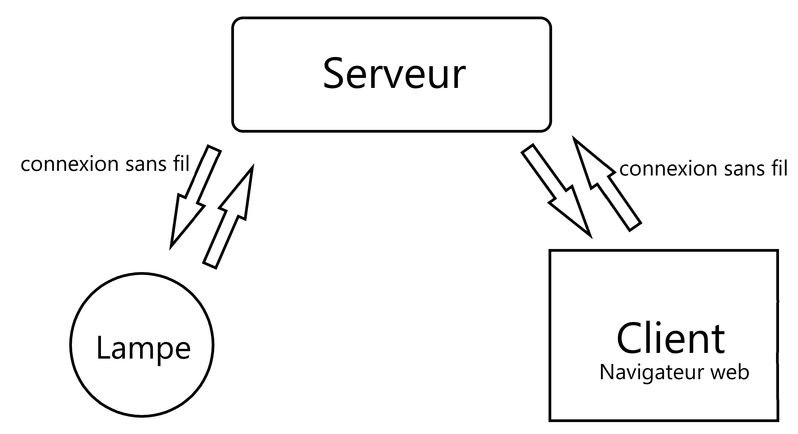

**1st year project, INSA CVL | 2019**

# RaspIoT

## Getting Started

* Install [Nodejs](https://nodejs.org/en/)
* Run the command: **npm install** (inside the folder, using the command line tool)
* To start the app: **npm run start**

The server starts and you can access to the web app using the localhost if you use the machine hosting the server, or via another device connected to the same wifi network, using the IP address of the host at port 3000.

## Goals

Successfully light a lamp remotely via a web interface (see diagram below)

## Specifications

### Creations

* Creation of the web interface
* Server creation
* Creation of lamps

### Use

The user can change the status of a lamp via his web browser
The user can change the state of a lamp via a conventional switch
The system must be efficient, and not turn on the lamp in 10 seconds, but as soon as possible from the user signal
The system must be stable and therefore spit as little as possible
Will be written a specification for the python, arduino and the web server which will detail the creation and operation of each, explaining in particular the code

## Use cases

### Example 1: Using the web interface

The client connects via his web browser to the server. The latter then gives him access to the web interface to take control of the various lamps in the server memory.
Suppose the user chooses to turn off a lamp. He then clicks the button provided for this purpose in the web interface. Data is transmitted to the server and then processed by the server. Once done, it is broadcast to other customers to inform them of the change of state and sent wirelessly to the lamp concerned, which changes state. Simple. On paper.

### Example 2: Using a conventional switch

Suppose now that the user presses the switch of a lamp to turn it on. He presses, the lamp comes on. But data is also transmitted from the lamp to the server. The server processes the data and sends it to each connected client to notify them of the state change.

## Web Server

Goal:
The purpose of the web server is twofold. It allows both to have a graphical interface to interact with the system, but also allows the manipulation of data for the entire system. That is to say that it is through him that the user will pass to control the different devices that are there, through a graphical interface. But it is also the place where all data is sent and processed. It is therefore obviously indispensable.
It consists of 3 elements, a raspberry Pi, the server, and 2 arduino, interface between the Pi and the different connected objects.

### Use cases

#### Example 1: Connecting a client

The server is plugged in, turned on, and ready to receive HTML requests. A client then connects to the server via the web browser of his choice. It therefore sends a request to the server which sends back, according to the URL, the corresponding page. If it goes to XXX.XXX.X.XX: 3000 /, the server then returns the home page, if it goes to a page that does not exist, the page is will be a page of error, 404 in this case.

#### Example 2: Adding and removing a lamp

For these 2 elements, the method is the same. This is a form that uses the POST method to send the data to the server. That is, once the user has filled in the different fields of the form, he clicks a submit button that sends the data. However, these are raw and must be processed before being used. Indeed, despite the constraints set up in the client-side HTML, it is very easy to override them and send anything to the server. This is why a cleaning system, verification (word length, correspondence) is set up in the server. If an error is detected then nothing happens and the user is notified. Otherwise, depending on the form, the database is modified accordingly and other clients that would be connected at the same time see the page of their browser to refresh to match the new data, if that is not done and that the user tries to interact with a lamp that does not exist, the server crash.

#### Example 3: Interaction with a lamp

When on the home page, where the set of lamps is located, the user interacts with one of them, a lot of things happen in the server. First, the database is updated as a result of the state change. Then, via websockets, a notification is sent in real time to update all the other web pages of connected clients, without having to refresh the page. This allows to have all the pages with the same data. Then, data is sent via USB to the arduino to act on the connected objects via a radio transmission, but this is more detailed in Python and Arduino.

### Design
#### Technologies used

**Hardware**
* 1 Raspberry Pi
* 2 Arduino

**Software**
* NodeJS
  * Major dependencies:
    * express
    * socketio
    * chokidar
    * python-shell
    * pug
    * Express-validator
    * and more than 700 other minor outbuildings

#### Operation

**Hardware**

The Raspberry Pi is a microcomputer, like your tower or your laptop, running with a PC OS, and not mobile. On ARM architecture, it is therefore not very powerful but largely enough to serve as server and above all consumes much less than a real dedicated server. Its cost is also very interesting for this type of project. It was therefore indispensable to our project.
The arduino, programmable low cost electronic card, is also part of the indispensable for this kind of project. It allows to control different components quite simply and in very effective ways.
I invite you to read wiki for more information.

**Software**

NodeJS is an open-source javascript environment, real-time cross-platform running outside the browser, on the server side. Why did you choose NodeJS to build the server instead of PHP or Python? For several reasons. First of all, after learning javascript on the client side, continuing on Node JS allows you to avoid having to relearn a new language. Then, with regard to Python, we did not know how it worked and especially the abilities it had. Then for PHP, it's more complex. Indeed, NodeJS creates its own server whereas PHP needs a server to work, Apache for example. The concern is that the OS Raspberry Pi is quite special and therefore the software is often not optimized to work properly. And this is the case of PHP which has a lot of trouble running on Raspbian, unlike NodeJS which is cross-platform by definition perfectly compatible.

The dependencies of NodeJS:
* express: allows you to create a server and manage its elements effectively
* socketio: allows the use of websockets, or at least a two-way communication in real time
* chokidar: to monitor file modification
* python-shell: allows to execute python scripts via NodeJS
* pug: template engine to generate HTML pages
* express-validator: to manage the sending of data by the user

### Problems encountered

Many.
First of all, the RaspIoT project does not come from the internet. There is no tutorial to redo what has been done from beginning to end. Therefore, and "happily", otherwise the project loses its meaning, everything has been written and reflected by the MULTI-PRISES team.
This implies a huge autonomy in the work since there is no support on which to rest. But it's actually more complex.
Indeed, each dependencies have their documentation, allowing to understand and know the functions that compose it. This allows, in a rather simple setting to easily set up the desired functions, just follow the doc. On the other hand, as soon as we start mixing different functions of different dependencies together, as soon as we start to create, that's where the problems appear. Simply because there are no tutorials, we end up creating, imagining and developing a new functional system. So for 3 dependencies, it goes. But for 8, as you say it is extremely complicated. We are alone, facing a problem. Fortunately, we can still count on StackOverflow.

### Feel about this work

Facing a mountain passable but with a lot of trouble was the initial feeling. Even though we knew a minimum, and we knew it was possible, in broad outline, it was something we had never done and we had only a vague idea of ​​how to get there . The precise how was very very vague. So much so that even if the end goal has not changed, the ways to get there have changed by 4 times. Each addition of lines of code is an error, a problem to be corrected later for it to work, but it is the game, a very pleasant game that has been completed.

## Python

### Goal
The purpose of the two Python scripts is to serve as gateways between the server written in NodeJS and running on a Raspberry Pi and Arduinos that allow the use of RF transmitters / receivers. They are essential because the python facilitates communication via the USB port. Indeed, this is possible without the python but becomes extremely complex.

### Use cases

#### Example 1: From Pi to Arduino

When a customer is on the lamp management page, he can interact with, on the page and in the real, via the server. Indeed, as we have seen in the Web Server design book, there is a mechanism to store and transmit to other customers what the customer has done. But something else is happening too. During a change of state of a lamp, the web server executes a python script by passing parameters to it, such as the name of the lamp and its state. The script is "very simple", only a few lines that allow to pass data from the server to the Arduino through a USB port. The Arduino receives the data and processes it accordingly.

#### Example 2: From Arduino to Pi

When a customer presses the physical switch, then a radio frequency message is sent to the server-side arduino receiver. A second python script comes right after. It makes it possible to make the link between the information transmitted by the arduino receiver to the server and the database. The script receives and interprets the data for storage in the database. This as long as the server is not turned off.

### Design

#### Technologies used

**Hardware**
* Raspberry Pi

**Software**
* Python
  * python-serial

#### Operation

**Hardware**
The Pi serves as support for script execution and USB data transmission. It also connects the server to the Arduino.

**Software**
In terms of add-ins, only the python-serial module is used. It is he who allows to simply transfer data between Pi and Arduino.

### Problems encountered

**From server to arduino:**
How does the serial port drive of the arduino IDE work? This is a very complex question. To understand it, we had to perform a lot of tests, especially since nothing is explained. First, to send several values ​​to it, you need spaces between them. Then what is the type of values? Int, Char, String (what encoding?) ... We noticed, thanks to certain functions, that the arduino reads String, in UTF-8. We think then that it's good. But no. When executing this script, we pass in parameter the values ​​to be sent to the arduino. But when we tested, it did not work. Indeed, we must tell the python what is the encoding to use. We convert the parameters to UTF-8. Then we send values ​​1 to 1. Still nothing. Indeed, as said above, it takes 1 character string, with the elements separated by spaces. We therefore cancatain our parameters and our spaces, thinking of encoding them in UTF-8, and we can send all to the arduino, who understands perfectly.

**From the arduino to the server:**
Inter-language communication is very complex. In fact, everything does not speak exactly the same way and it is these small differences that pose the biggest problems. One would think that when a "1" does not matter the language. But it's wrong. Indeed, when the arduino sends a "1" via the serial port, it does not send a "1". This is because the "1" is not the same "1" everywhere. Indeed, the arduino sends it as a byte, so we have to decode it and pass it in UTF-8. And there, surprise, the arduino also sends another character. So we get "1 \ r \ n", so we'd like the 1. We remove the unwanted characters and we convert it to int. The writing of this script, which does however only a few lines, was long and perilous because it is information that is found nowhere. We had to do a lot of tests to understand the operation and to see these differences

### Feel about this work
It seemed simple, but proved complex. Indeed, we did not expect all these type conversion and encoding problems. It took us a long time to understand how these different languages ​​work and how they manage the data and how to adapt our program. It was very instructive.

## Arduino

